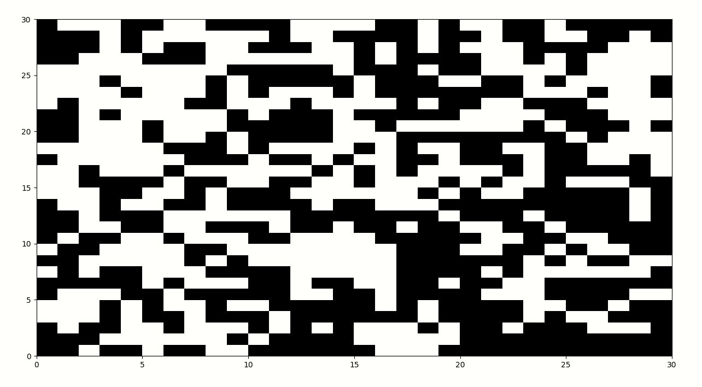
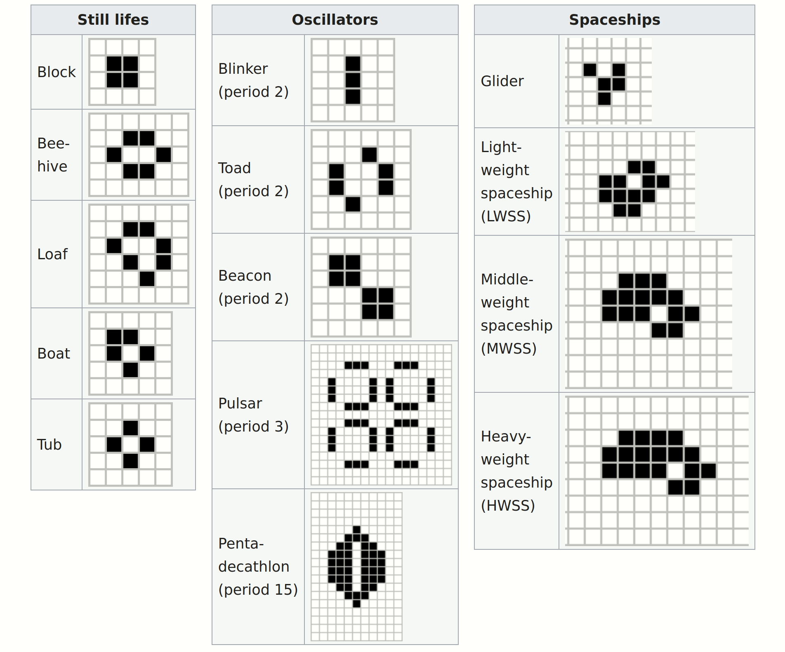
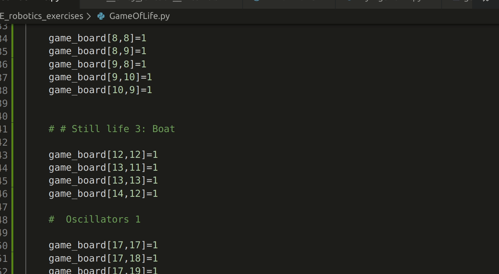
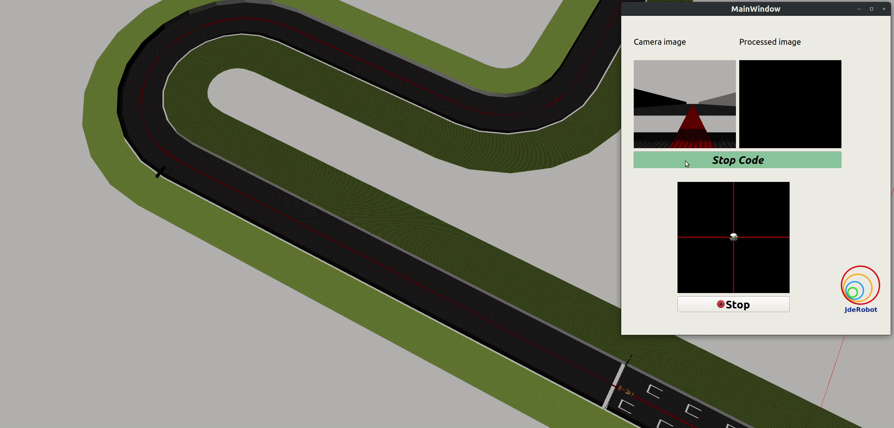

# JDE_robotics_exercises

- [JDE_robotics_exercises](#jderoboticsexercises)
  - [GSOC Requirements](#gsoc-requirements)
  - [Python implementation of Game of Life](#python-implementation-of-game-of-life)
      - [Requirements](#requirements)
      - [To execute](#to-execute)
      - [Demonstration](#demonstration)
      - [Test](#test)
      - [Known Life](#known-life)
  - [C++ exercise](#c-exercise)
  - [Academy Challenge](#academy-challenge)
    - [Follow Line exercise](#follow-line-exercise)
      - [Image Processing](#image-processing)
      - [Visual servoing](#visual-servoing)
      - [Ice library mismatch](#ice-library-mismatch)
    - [Other exercises](#other-exercises)
  - [Industrial Challenge](#industrial-challenge)


## GSOC Requirements

- [x] Python challenge

- [x] Academy challenge

- [ ] C++ challenge


##  Python implementation of Game of Life


#### Requirements

- Python2.7
- Numpy
- Matplotlib

It should have been implemented only using the standard library and numpy, I have added matplotlib for a nicer visualization but the board can be easily printed as a numpy matrix.


#### To execute
```
Python GameofLife.py
```

#### Demonstration




#### Test

 I expect to see these forms of life.




#### Known Life

You can some of the still and oscillating patterns as well as the glider.



##  C++ exercise

I am currently working on it. 

-[x] read input from random patterns in txt files

-[ ] writing a common implementation of Djkstra algorithm based on Graphs and Edges classes.

-[ ] writing the translation from text input to input graph


## Academy Challenge

### Follow Line exercise

I managed to install and start all the exercises and I have started to solve them with the follow_line exercise.




My solution is very basic. It consists in:

- image processing to extrapolate the centroid of the red line
- Visual servoing PID contro
  
#### Image Processing

I perform the operation in hsv space as usually it is more robust then rgb space for color extraction. 

```
hsv = cv2.cvtColor(image, cv2.COLOR_BGR2HSV)

lower_color_bounds = np.array([100, 100, 0])
upper_color_bounds = np.array([180,255,255])

mask = cv2.inRange(hsv,lower_color_bounds,upper_color_bounds )
mask_rgb = cv2.cvtColor(mask,cv2.COLOR_GRAY2BGR)

kernel = np.ones((2,2),np.uint8)
mask_rgb=cv2.erode(mask_rgb,kernel, iterations=2)
mask_rgb=cv2.dilate(mask_rgb, kernel, iterations=3)

# calculate moments of binary image
M = cv2.moments(mask)

# calculate x,y coordinate of center
if M['m00']!=0:
    cX = float(M["m10"] / M["m00"])
    cY = float(M["m01"] / M["m00"])
    # Put a marker 
    mask_rgb=cv2.circle(mask_rgb, (int(cX), int(cY)), 20, (0, 255, 0), 20)
``` 

#### Visual servoing
            
```
# PD component

Kp=1
Kd=0.5
# error 

error= (320.0-cX)/320

#error derivative

self.error_history.append(error)
if len(self.error_history)==3:
    self.error_history=self.error_history[1:3]

d_error=(self.error_history[1]-self.error_history[0])/14

#Compute Command

W=Kp*error-Kd*d_error

```
#### Ice library mismatch
I have noticed that there may be some incongruencies between the used version of the ice library. The follow line exercise requires 3.7.1 version while the Force field exercise apparently requires 3.6.3.


### Other exercises

I managed to start almost all the exercises and I will work on them in the next few days.


- Force field


## Industrial Challenge

For now I just installed all the required packages but I still have to fix all the errors. I have already managed to use MoveIT with another robotic manipulator.